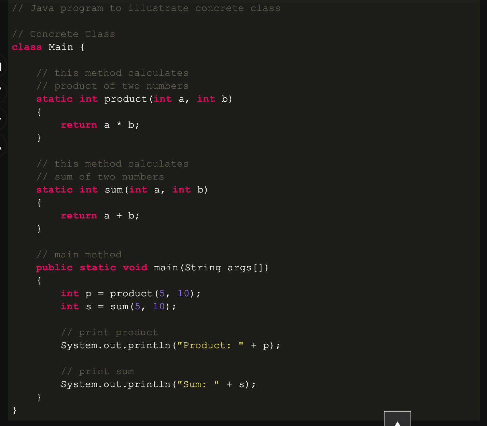

# Class

## Introduction

A class is the blueprint for creating the objects (a particular data structure) providing initial value for the state (member variables or attributes), and implementation of the behaviour (member functions or the methods).

The class is the blueprint that defines the nature of the future object. An instance is the specified object created from a
particular class.

## Instance

Instance is a specified object created from a particular class.

## Variables

### Instance Variable

Instance variable is a variable that is associated with the specified instance of an class. Let's suppose there is class called `car` with attribute `model`. Maruti car and Mustang car can be the two instances of this class. Even though the attribute `mode`
is same. The value for each of the car attribute would be different. They would be tied to their specific instance.

### Class Variable

Class variable refers to the attributes that are simply variable of the class. These variable are shared among all the instances of the class. Changing this variable will affect all the instance of the class.

## Important Notes

> Class are created using the keyword `class`.

> Class name should be started with initial letter (capitalized by convention).

> After declaring the class name, programmer must define the constructor method

> Class contains the attributes and methods

> Interfaces: A class can implement more than one interface

> When an abstract class implements the interface then it is not compulsory to implement all the methods by it.

## Concrete Class

A * Concrete class * is a class that has an implementation of all of its method. They can not have any unimplemented methods. It can extend/inherit the abstract class or any interfaces as long as it implement all their methods.
Example:

