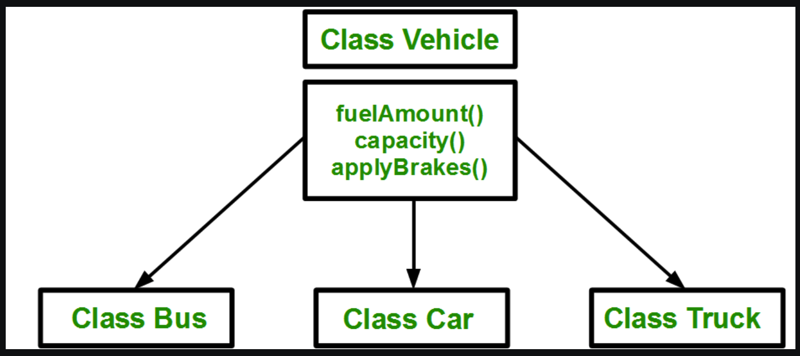
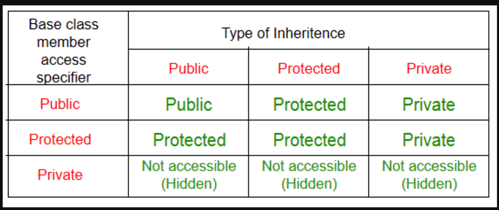
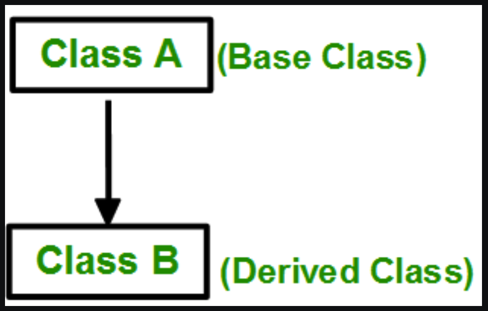
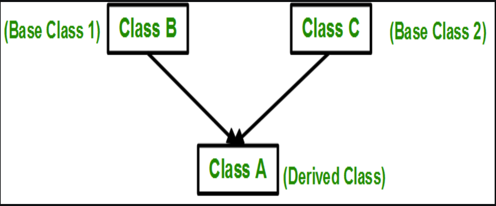
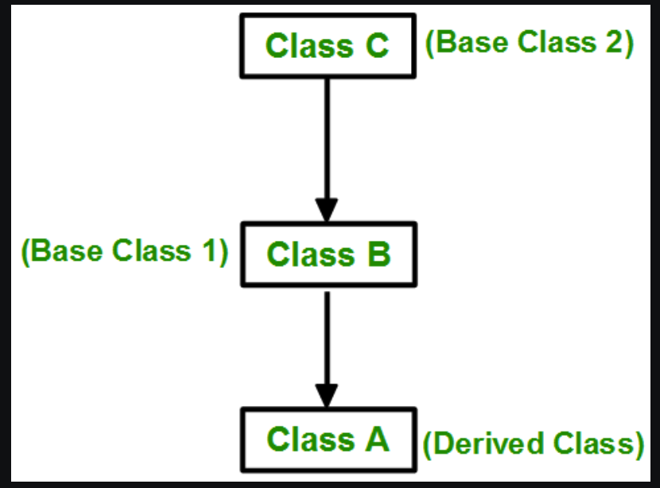
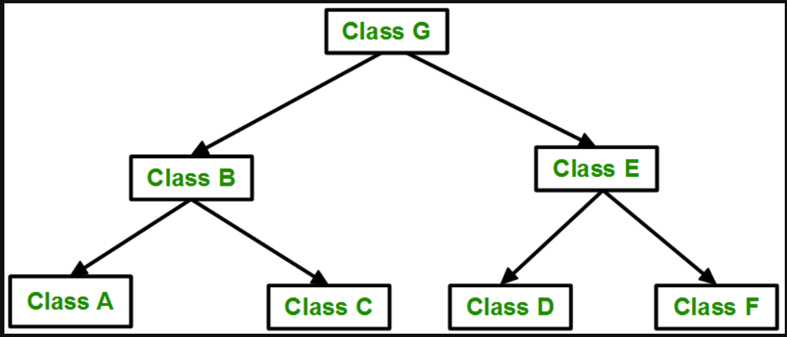
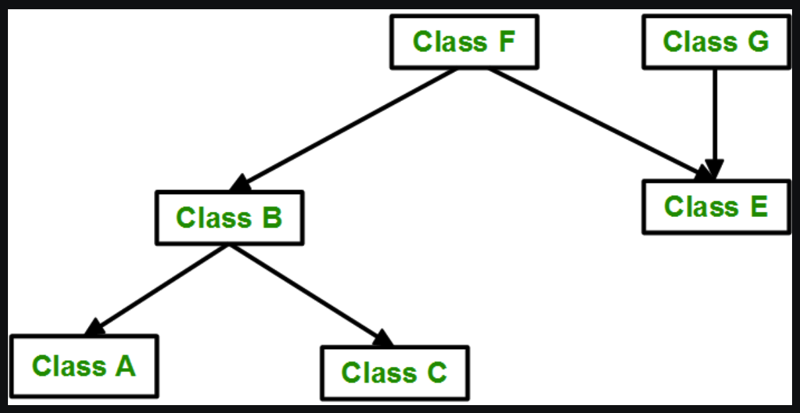

# Inheritance

## Introduction

The capability of a class to derive properties and characteristics from another class is called Inheritance.

> Sub or Dervied Class: The class that inherits properties from another class is called Sub class or Derived Class. 

> Base or Super Class: The class whose properties are inherited by sub class is called Base Class or Super class. 

## When To Use Inheritance

`
Consider a group of vehicles. You need to create classes for Bus, Car and Truck. The methods fuelAmount(), capacity(), applyBrakes() will be same for all of the three classes. If we create these classes avoiding inheritance then we have to write all of these functions in each of the three classes
`

`
If we use inheritance then same properties and method can be re-used among the different relative classes. Thus removing the duplication.
`

## Mode Of Inheritance

> Public Mode:

` 
If we derive Sub Class from the Public Base Class. Then the public member of the base class will become public in the derived class and protected members of the base class will become protected in derived class.
`

> Protected Mode:

`
If we derive a sub class from a Protected base class. Then both public member and protected members of the base class will become protected in derived class.
`

> Private Mode:

`
If we derive a sub class from a Private base class. Then both public member and protected members of the base class will become Private in derived class. 
`

`
Note: The private member in the Base Class cannot be directly accessed by the Sub Class. While the protected member can be directly accessed in the Sub Class.
`

## Summary Of Three Modes Of Inheritance

# Types Of Inheritance

## Single Inheritance

`
 In single inheritance, a class is allowed to only inherit the properties and method from the single Base Class.
 ie. One Sub Class is inherited from only one Base Class.
`

`
Syntax:
class sub-class: access_mode base-class {
    // body of sub-class
}
`

## Multiple Inheritance

`
In Multiple inheritance, a sub class inherits from multiple Base Class.
`

`
Syntax:
class sub-class: access_mode base-class1, access-mode base-class2, ... {
    // body of sub-class
}
`

## Multi Level Inheritance

`
In this type of inheritance, a derived class is created from another derived class.
`

## Heirarchial Inheritance

`
In this type of inheritance, more than one sub class is inherited from a single base class. i.e. more than one derived class is created from a single base class.
`

## Hybrid (Virtual) Inheritance

`
 Hybrid Inheritance is implemented by combining more than one type of inheritance. For example: Combining Hierarchical inheritance and Multiple Inheritance. 
`

## A Special Case Of Hybrid Inheritance : Multipath Inheritance:

`
A derived class with two base classes and these two base classes have one common base class is called multipath inheritance. An ambiguity can arrise in this type of inheritance. 
`

