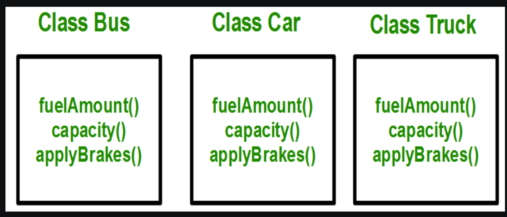

# Inheritance

## Introduction

The capability of a class to derive properties and characteristics from another class is called Inheritance.

> Sub or Dervied Class: The class that inherits properties from another class is called Sub class or Derived Class. 

> Base or Super Class: The class whose properties are inherited by sub class is called Base Class or Super class. 

## When to use inheritance

`
Consider a group of vehicles. You need to create classes for Bus, Car and Truck. The methods fuelAmount(), capacity(), applyBrakes() will be same for all of the three classes. If we create these classes avoiding inheritance then we have to write all of these functions in each of the three classes
`

`
If we use inheritance then same properties and method can be re-used among the different relative classes. Thus removing the duplication.
`

