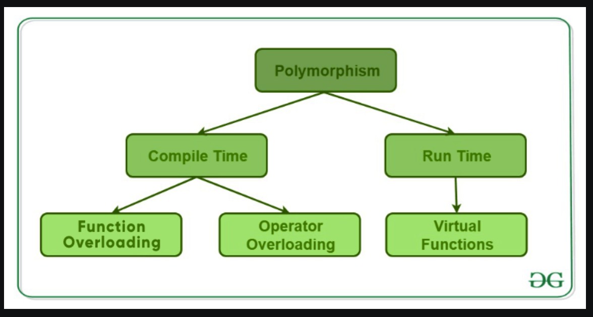
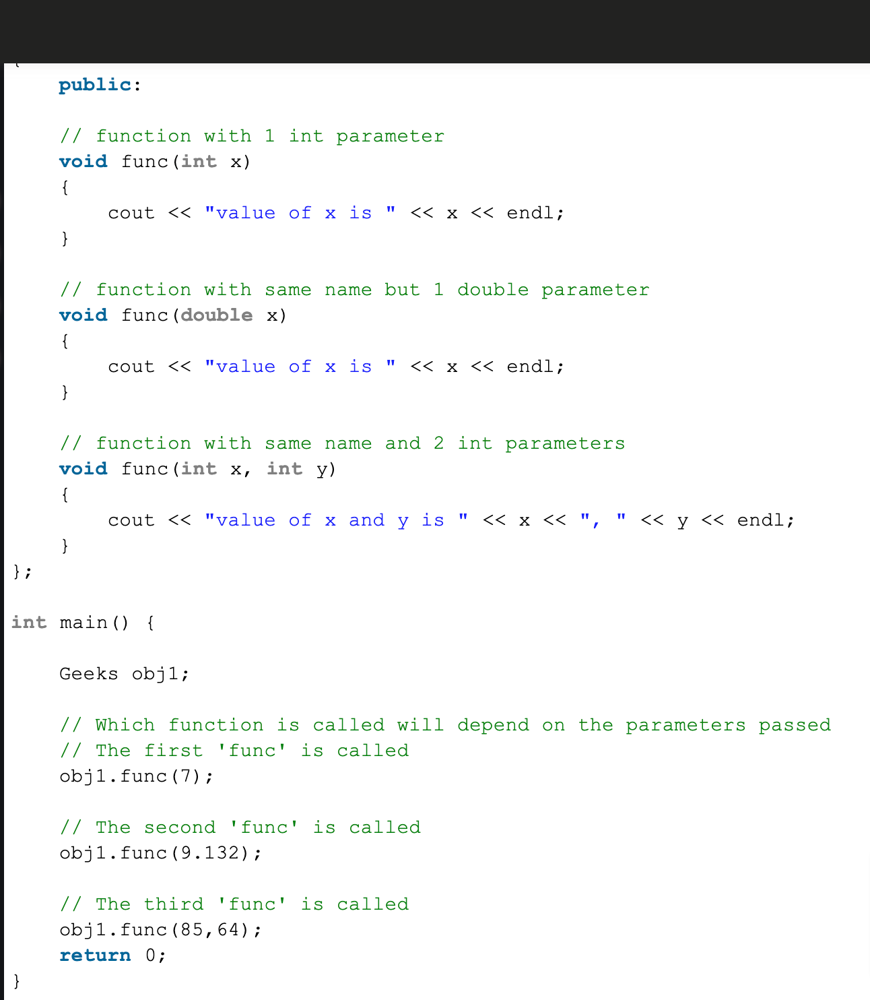
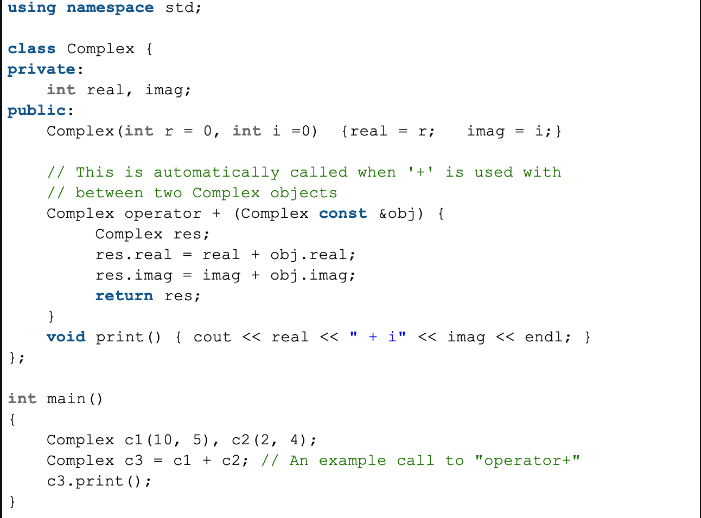
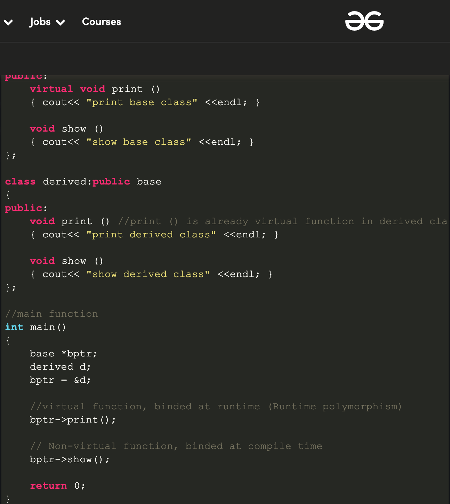

# Polymorphism

## Introduction

Polymorphism means having many form. It is an ability to display message in many form. 

Real life example: A person at the same time can be a `father`, `husband` and `employee`.
So the same person posseses different behaviour in different situations. This is called 
Polymorphism

## Types Of Polymorphism

> Compile time Polymorphism

> Run time Polymorphism

## Compile time Polymorphism

This type of polymorphism is achieved by function overloading or operator overloading.

### 1. Function Overloading

When there are multiple functions with the same name but different parameters then these functions are said to be overloaded. Functions can be overloaded by changing the number of arguments or changing in the type of arguments.

In the above image, the single function behaves differently in different situation which is the property of Polymorphism.

### 2. Operator Overloading

We can make operator `(+)` for string to concatenate two string. We can use same operator to add two operands. So same operator is behaving differently in different situation which is the property of Polymorphism.

In the above example, operator `+` is used to add the two imaginary and complex numbers.

## Run time Polymorphism

This type of polymorphism is achieved by `Function Overriding`.

### 1. Function Overriding

If the derived class has a definition for one of the member method and if the same method is also present in the base class then that base function/method is said to be overriden.

